# 여행거르미

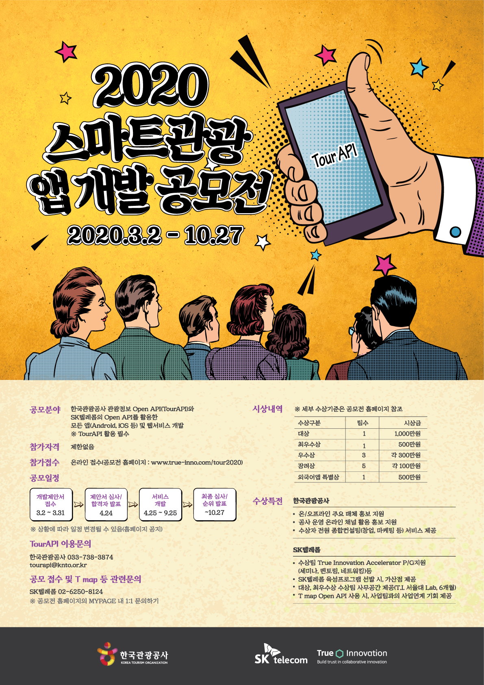   
https://www.true-inno.com/ko/suggestionView.do?cSeq=46ad7bc159da30c5b21b7871260a9f8f&strSearchType=

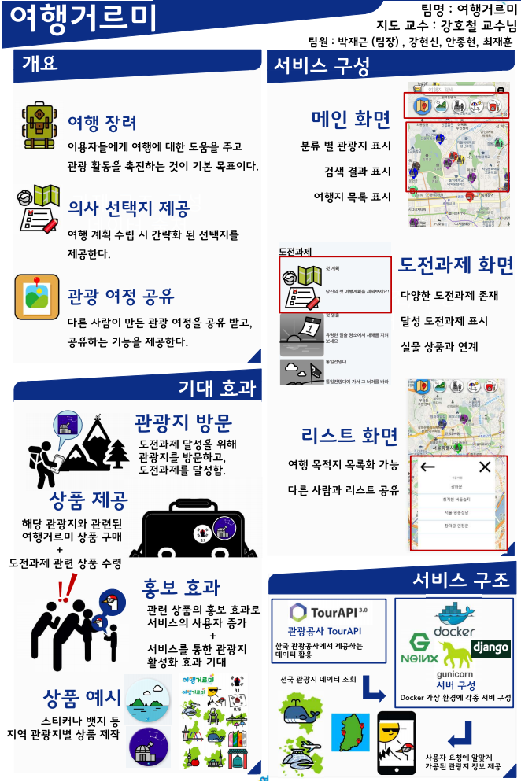

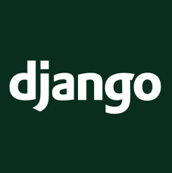
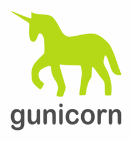

## 프로젝트 개요
- 이용자들에게 여행에 대한 도움을 주고 관광 활동을 촉진하는 것
- 여행 계획 수립 시 간략화 된 선택지를 제공
- 다른 사람의 관광 여정 공유
  
## 개발환경 구축 
- 새로운 언어사용과 개발방법 등의 학습 목적 (Python, django, nginx, docker 등)
- DJANGO를 사용하여 빠르게 서비스를 구축 

## 지역 활성화와 서비스의 성장
### 어플리케이션의 프로세스 
여행거르미 어플 사용 -> 도전과제 달성을 위한 관광지 방문 -> 도전과제 달성 -> 해당 도전과제 제품 구매 -> 제품의 어플 홍보 기능 -> 어플 이용자 증가
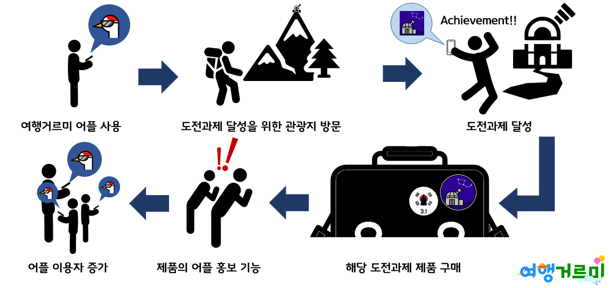

## 프로젝트 기능

### 기본 기능
- 분류별 관광지 표시 
- 검색 결과 표시
- 여행지 목록 표시

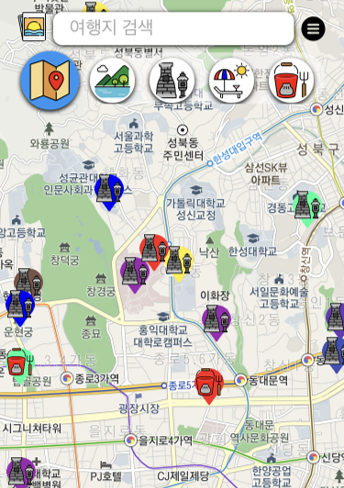

### 도전과제 화면
- 다양한 도전과제 존재
- 달성 도전과제 표시
- 실물 상품과 연계

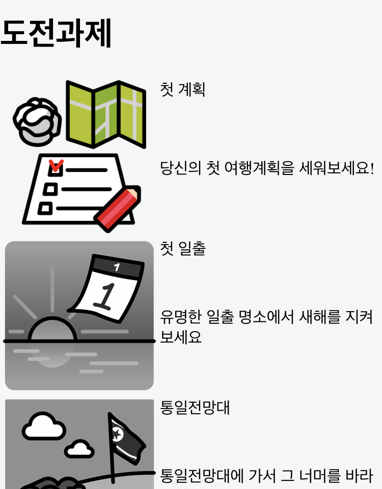

### 리스트 화면 
- 여행 목적지 목록화 기능
- 다른 사람과 리스트 공유

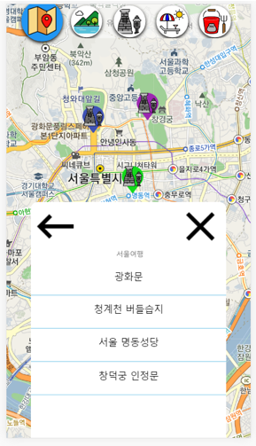

## 어플 관련 제품
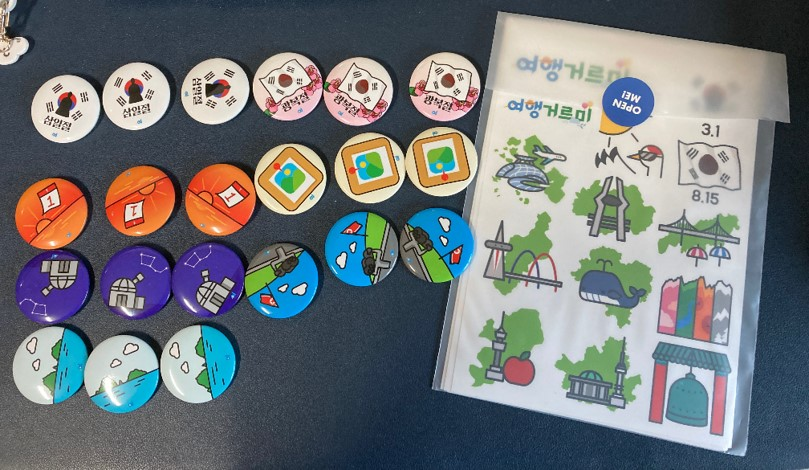
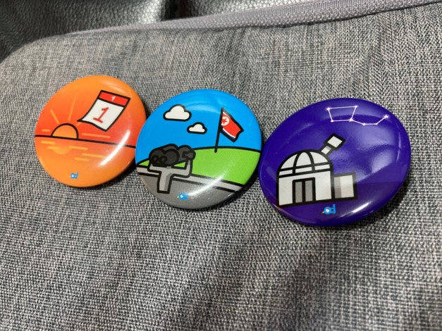
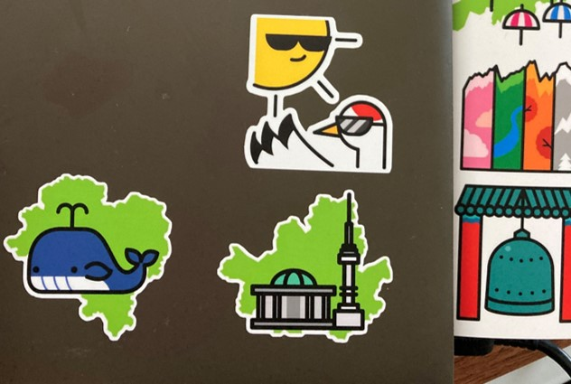

## 업무 분담
- 강현신 
    - 프론트 구현 및 CSS적용, 형상 관리
- 박재근
    - 좌표, 마커 관련 기능 등의 서비스 기능 구현
- 안종현
    - 커뮤니티 및 DB 관련 기능 구현
- 최재훈
    - 사진 및 UI 모드 변경 관련 기능 구현

## 후기

### 어려웠던 점 
- 새로 시도하는 프레임워크의 어려움
- 모바일 클라이언트에서 위치 정보 등의 권한 확보의 어려움
- PWA 및 서버 구축 미숙으로 인한 어려움
- 개발 기간 장기화 및 거대해진 프로젝트 규모로 인한 능률 저하
- 코로나로 인한 회의 및 개발 진행 어려움

### 극복 방법
- 각자 시간을 투자하고 공부하여 미숙한 부분 학습
- 화상 회의를 이용해 최대한 소통하려고 노력 
- 많은 메신저 회의 또는 화상회의로 능률 저하를 최대한 극복
  
### 프로젝트 의의
- 프론트 엔드 개발 능력 향상 
- Django를 이용한 백 엔드 개발 능력 향상
- Docker 기반 웹 서버 운용 및 구축 경험
- PWA에 관한 지식 습득

### 프로젝트를 마무리하며
- 2020 스마트관광 앱 개발 공모전 탈락
- 2020-2학기 캡스톤 경진대회 탈락
- 여러가지 경험들과 지식들 학습
